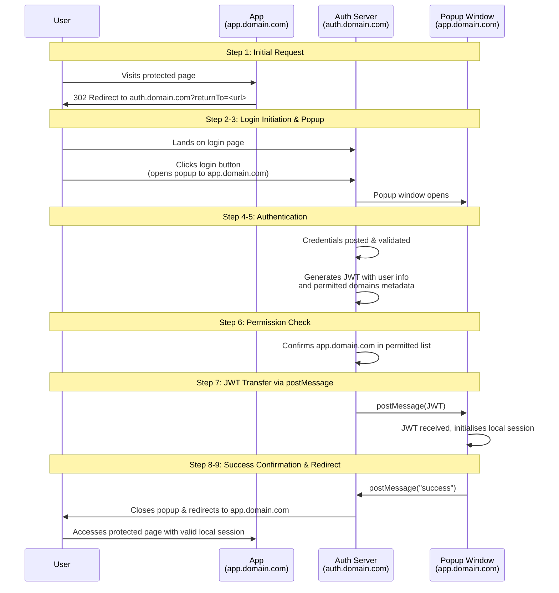

---
title: "Simplifying SaaS Authentication Across Multiple Domains"
draft: false
date: 2025-10-04T9:00:00.000Z
description: "A clean, user-friendly single-sign-on experience across multiple customer domains, simplifying a traditionally complex part of SaaS architecture."
categories:
  - Authentication
  - SaaS
tags:
  - Authentication
  - SaaS
  - CORS
---

When building a SaaS application, it's common to provide each customer with their own subdomain or custom domain. However, you typically need a centralised system for user authentication and management. This centralised approach is crucial for billing, as it maps users to their subscribed services.

Users often need access to multiple application instances, making a single-sign-on (SSO) system essential. SSO eliminates the friction of managing separate logins for each instance and repeatedly logging in and out.

Combining custom domains with centralised authentication introduces complexity. Browsers treat each domain as separate, with isolated session storage, local storage, and cookies. For security reasons, one domain cannot access another's stored data, making authentication state sharing challenging.

Traditional solutions typically redirect users to a central authentication system and back, requiring backend services to communicate. While functional, this process can feel clunky.

### A Client-Side Approach with JWT and Popups

What if we could handle multi-domain authentication entirely client-side, without additional server communication? We can achieve this using JSON Web Tokens (JWT) and the browser's postMessage API.

Here is how the process works:

1. A user visits a protected page on app.domain.com
2. They're redirected to your auth domain, auth.domain.com, with the original URL as a query parameter
3. The user clicks the login button, which immediately opens a popup window to the target domain app.domain.com (this must happen on button click due to browser popup restrictions)
4. The credentials are posted to the auth server for validation
5. The auth server returns a JWT containing basic user information along with unencrypted metadata, including a list of domains the user has permission to access
6. The system confirms that app.domain.com is on the user's permitted list
7. Using postMessage, the JWT is sent to the pre-opened popup window
8. The target domain receives the JWT and initialises its local authentication session
9. The popup sends a success message back to the parent window
10. The parent window closes the popup and redirects the user to app.domain.com

The user is now authenticated on both the auth domain and the application domain, with all the complexity handled seamlessly by the client.

Since browsers only allow popup's to open in direct response to user actions, the child window must be opened when the user clicks the login button. The authentication form then displays a "Processing..." state while the backend validation occurs. If authentication fails, the popup closes and an error message is displayed. If successful, the JWT transfer proceeds as described.

This implementation doesn't require any special server configuration such as CORS (Cross-Origin Resource Sharing). The authentication flow relies on standard browser redirects, popup windows, and the postMessage API for cross-domain communication, all of which work without CORS configuration.

This approach delivers a clean, user-friendly single-sign-on experience across multiple customer domains, simplifying a usually complex aspect of SaaS architecture.