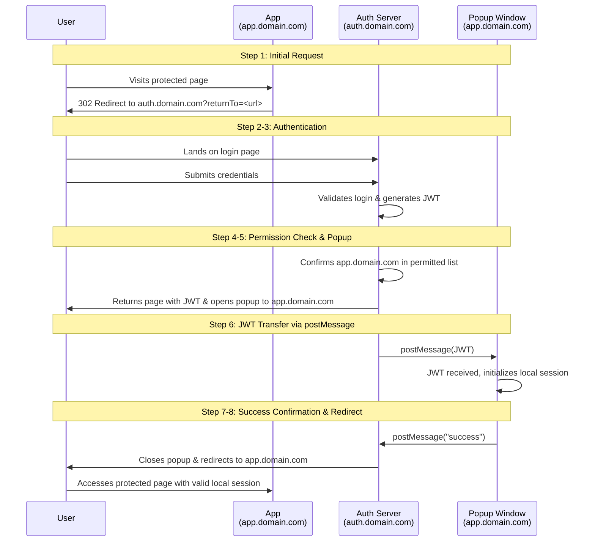

---
title: "Simplifying SaaS Authentication Across Multiple Domains"
draft: false
date: 2025-10-04T9:00:00.000Z
description: "A clean, user-friendly single-sign-on experience across multiple customer domains, simplifying a traditionally complex part of SaaS architecture."
categories:
  - Authentication
  - SaaS
tags:
  - Authentication
  - SaaS
  - CORS
---

When building a SaaS application, it is common to give each customer their own subdomain or custom domain. At the same time, you often need a central system for user authentication and management. This is crucial for billing, as it maps which users are subscribed to which services.

Users may also need access to multiple application instances. A single-sign-on (SSO) system is essential here. It prevents the awkwardness of users managing separate logins for each instance and having to log in and out repeatedly.

However, combining custom domains with centralised authentication introduces complexity. The browser treats each domain as separate, with its own session storage, local storage, and cookies. For security reasons, one domain cannot access data stored by another. This makes sharing authentication states tricky.

A typical solution involves redirecting users to a central auth system and back again, which requires backend services to communicate. While it works, this process can be clunky.

### A Client-Side Approach with JWT and Popups

What if we could handle the logistics of multi-domain authentication entirely on the client side, without further server communication? We can achieve this using JSON Web Tokens (JWT) and the browser's postMessage API.

Here is how the process works:

1. A user visits a protected page on `app.domain.com`.
2. They are redirected to your auth domain, `auth.domain.com`, with the original URL as a query parameter.
3. The user logs in. The auth server returns a JWT containing basic user information, including a list of domains they can access.
4. The system confirms that `app.domain.com` is on the user's permitted list.
5. A child window (popup) is opened to the target domain, `app.domain.com`. Using `postMessage`, the JWT is sent to this new window.
6. The target domain receives the JWT and uses it to initialise its own local authentication session.
7. The popup sends a message back to the parent window to confirm success.
8. The parent window closes the popup and redirects the user to `app.domain.com`.

The user is now authenticated on both the auth domain and the application domain, with all the complexity handled seamlessly by the client.

A key point to remember is that browsers only allow a popup to be opened directly in response to a user action, such as clicking a button. Therefore, you must open the child window at the moment the user submits the login form. A simple `"Authenticating..."` message is then shown. If authentication fails, the popup closes and an error is displayed. If it succeeds, the flow continues as described.

This method provides a clean, user-friendly single-sign-on experience across multiple customer domains, simplifying a traditionally complex part of SaaS architecture.
